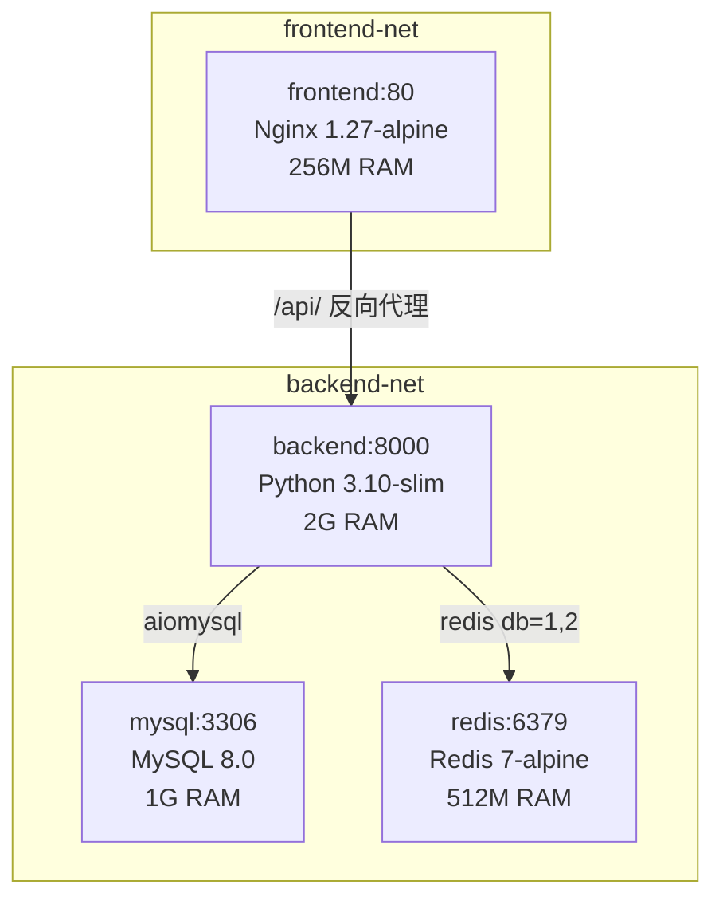

# 基于多智能体的医生临床问诊评估平台 — 技术说明文档

> **文档版本**: v1.0  
> **项目**: 基于多智能体的医生临床问诊评估平台  
> **技术栈**: FastAPI 0.115.6 + LangGraph 1.2.6 + React 19 + ChromaDB + Redis + MySQL  
> **概述**: 本平台采用前后端分离的 B/S 架构，后端基于 FastAPI 提供 RESTful API + SSE 流式推送，前端为 React 19 + TypeScript SPA。核心业务围绕多智能体编排展开，通过 LangGraph StateGraph 实现 Plan-Execute + Send fan-out/fan-in 的并行评估流水线，结合 RAG 检索增强生成系统（BM25 + 向量 + 分级检索 + 两阶段重排序），使用 Qwen 大模型完成问诊分析、诊断评估、治疗评估、医学知识一致性检查和人文关怀评估五个维度的临床问诊质量评估。

---

## 第一章：项目总体架构

### 1.1 整体系统架构设计

本平台采用**前后端分离**的 B/S 架构，后端提供 RESTful API + SSE 流式推送，前端为单页应用（SPA）。核心业务逻辑围绕**多智能体编排**展开，通过 LangGraph StateGraph 实现 Plan-Execute + Send fan-out/fan-in 的并行评估流水线。

```
┌──────────────────────────────────────────────────────────────────┐
│                        前端 (React 19 + Vite 7)                  │
│   Ant Design 6 · TypeScript · SSE 流式接收 · WebSocket 进度       │
└──────────────────────┬───────────────────────────────────────────┘
                       │ HTTP / SSE / WebSocket
┌──────────────────────▼───────────────────────────────────────────┐
│                   后端 (FastAPI 0.115.6)                          │
│  ┌─────────┐  ┌──────────┐  ┌──────────────────────────────┐    │
│  │ API 层  │→ │ 编排层   │→ │      智能体服务层              │    │
│  │ 6 路由  │  │ LangGraph│  │ Safety · 问诊 · 诊断 · 治疗   │    │
│  └─────────┘  │ StateGraph│  │ 知识核对 · 人文关怀 · 反思    │    │
│               └──────────┘  │ 建议指导 · 综合评分            │    │
│  ┌─────────┐                └──────────┬───────────────────┘    │
│  │ 数据层  │  ┌──────────┐             │                        │
│  │ MySQL + │  │ RAG 系统 │←────────────┤                        │
│  │ Redis   │  │ BM25+向量 │             │                        │
│  └─────────┘  │ ChromaDB │     ┌───────▼───────────┐            │
│               └──────────┘     │    工具系统        │            │
│                                │ 检索·引用校验·一致性│            │
│                                └───────────────────┘            │
└──────────────────────────────────────────────────────────────────┘
```

### 1.2 技术栈选型

| 层级 | 技术 | 版本 | 用途 |
|------|------|------|------|
| Web 框架 | FastAPI | 0.115.6 | 异步 HTTP 服务、自动 OpenAPI 文档 |
| ORM | SQLAlchemy (asyncio) | 2.0.36 | 异步数据库操作 |
| MySQL 驱动 | aiomysql + pymysql | 0.2.0 / 1.1.1 | 异步/同步 MySQL 连接 |
| 数据校验 | Pydantic + pydantic-settings | 2.10.4 / 2.7.1 | 请求校验、配置管理 |
| 认证 | python-jose + passlib | 3.3.0 / 1.7.4 | JWT 签发、bcrypt 密码哈希 |
| LLM 调用 | openai SDK | 1.58.1 | Qwen 兼容接口调用 |
| 编排框架 | LangGraph | 1.2.6 | StateGraph 多智能体编排 |
| Checkpoint | langgraph-checkpoint-redis | 0.4.1 | AsyncRedisSaver 状态持久化 |
| 向量数据库 | ChromaDB | 1.5.7 | 医学文档向量存储 |
| Embedding | DashScope text-embedding-v4 | — | 1024 维文本向量化 |
| Rerank | DashScope gte-rerank | — | 两阶段重排序粗排 |
| PDF 解析 | PyMuPDF | 1.27.2.2 | 医学教材 PDF 分块 |
| 速率限制 | slowapi | ≥0.1.9 | IP 维度 API 限流 |
| 前端框架 | React + TypeScript | 19 / 5.x | 前端 SPA |
| UI 组件库 | Ant Design | 6.x | 企业级 UI 组件 |
| 构建工具 | Vite | 7.x | 前端开发服务器与打包 |

> **关键源文件**：`backend/requirements.txt`（23 个直接依赖）

### 1.3 目录结构说明

| 顶层目录 | 职责 |
|----------|------|
| `backend/` | FastAPI 后端服务，含 API 层、编排层、智能体、RAG 系统、评分引擎、工具系统 |
| `frontend/` | React 19 + TypeScript + Vite 7 + Ant Design 6 前端 SPA |
| `database/` | SQL 建表脚本 `init.sql` 和 7 个幂等增量迁移脚本 `migrate_v2` ~ `migrate_v7` |
| `dataset/` | 150+ 真实医院病例评测数据集（按 `patient{N}_{age}` 组织），已 gitignore |
| `data/` | 80+ 部医学教材 PDF（内科学第10版、外科学第10版、CSCO/NCCN 2025 指南等） |
| `docs/` | 项目文档 |
| `.github/workflows/` | CI/CD 配置（`ci.yml`：backend-test / frontend-build / code-quality 三个 Job） |

### 1.4 模块间依赖关系与调用链路

**核心调用链路**（一次完整评估）：

```
用户触发评估
  → API 层 (evaluations.py)
    → 构建 EvaluationContext (context.py)
    → StateGraph.invoke() (graph.py)
      → load_context → classify_consultation → safety_check
      → plan_evaluation → validate_plan (routes.py)
      → Send fan-out → run_agent × N (adapters/registry.py)
        → 各 Agent 适配器 → 底层 Agent 函数
          → Knowledge Agent → RAG 管线 (rag/) + 工具系统 (tools/)
      → fan-in → aggregate_results
      → deterministic_scoring (scoring/calculator.py)
      → reflection_check (agents/reflection_agent.py)
      → generate_suggestion → finalize → END
    → 写入 Evaluation 模型 → 返回报告
```

---

## 第二章：后端架构详解

### 2.1 FastAPI 应用入口与中间件链

> **关键源文件**：`backend/app/main.py`（196 行）

应用通过 `lifespan` 异步上下文管理器完成生命周期管理：

```python
@asynccontextmanager
async def lifespan(app: FastAPI):
    async with engine.begin() as conn:
        await conn.run_sync(Base.metadata.create_all)  # 确保表存在
    settings.check_security()            # 检查 SECRET_KEY
    register_all_adapters()              # 注册 5 个 Agent 适配器
    await init_checkpointer(...)         # 初始化 Redis Checkpointer
    yield
    await close_checkpointer()           # 关闭 checkpointer
    await close_cache_redis()            # 关闭 LLM 缓存 Redis
```

**中间件链（由外到内）**：

| 层级 | 中间件 | 功能 |
|------|--------|------|
| 1（最外层） | `CORSMiddleware` | 允许 `localhost:5173` 和 `localhost:3000` 跨域 |
| 2 | `request_log_middleware` | 注入 X-Request-ID、记录请求耗时 |
| 3（最内层） | `slowapi` 速率限制 | 基于 IP 的 API 限流 |

**异常处理器矩阵**：

| 异常类型 | HTTP 状态码 | error_code |
|----------|------------|------------|
| `RateLimitExceeded` | 429 | RATE_LIMIT_EXCEEDED |
| `HTTPException` | 动态 | HTTP_{status_code} |
| `RequestValidationError` | 422 | VALIDATION_ERROR |
| `SQLAlchemyError` | 503 | DB_UNAVAILABLE |
| `Exception` | 500 | INTERNAL_SERVER_ERROR |

### 2.2 路由分层设计

> **关键源文件**：`backend/app/api/v1/__init__.py`（18 行）

所有路由挂载在 `/api/v1` 前缀下，共 6 个路由模块：

| 前缀 | 模块文件 | 职责 | 关键端点 |
|------|----------|------|----------|
| `/auth` | `auth.py` | 用户认证 | 注册、登录、获取当前用户、更新资料 |
| `/patients` | `patients.py` | 虚拟患者管理 | CRUD 操作 |
| `/consultations` | `consultations.py` | 问诊交互 | 问诊 CRUD + SSE 流式消息端点 |
| `/evaluations` | `evaluations.py` | 评估管理 | 触发评估、查看评估报告 |
| `/knowledge-base` | `knowledge_base.py` | 知识库管理 | 统计、添加 PDF、重建索引、清缓存 |
| `/stats` | `stats.py` | 管理员面板 | 统计数据查询 |

### 2.3 数据模型层

> **关键源文件**：`backend/app/models/`（共 8 个 SQLAlchemy 模型）

| 模型 | 表名 | 核心字段 | 说明 |
|------|------|----------|------|
| `User` | `users` | id, username, email, hashed_password(TEXT), real_name, role(doctor/admin), department, avatar | 用户与角色管理 |
| `VirtualPatient` | `virtual_patients` | id, name, age, gender, personality_type(配合型/焦虑型/沉默型/对抗型), chief_complaint, medical_history, symptoms(JSON), expected_diagnosis, system_prompt, difficulty_level | 虚拟患者配置 |
| `Consultation` | `consultations` | id, doctor_id, patient_id, status(in_progress/completed/evaluated), diagnosis, treatment_plan, consultation_type(initial/follow_up/communication), max_rounds(默认20) | 问诊会话 |
| `ConsultationMessage` | `consultation_messages` | id, consultation_id, role(doctor/patient), content, sequence | 问诊消息记录 |
| `Evaluation` | `evaluations` | id, consultation_id(unique), 5 维度 score+analysis, total_score, overall_summary, improvement_suggestions, RAG 审计字段, LangGraph 审计字段 | 评估报告 |
| `EvaluationRun` | `evaluation_runs` | id(UUID PK), consultation_id, evaluation_id, graph_version, scoring_policy_version, status, selected_agents(JSON), execution_results(JSON), attempt | 评估运行记录 |
| `EvaluationNodeResult` | `evaluation_node_results` | id, run_id(FK), node_name, attempt, status, duration_ms, result_summary(JSON), error_type | 节点级执行追踪 |
| `AuditLog` | `audit_logs` | id, user_id, action(5种枚举), resource_id, ip_address, user_agent, detail | 审计日志 |

### 2.4 核心配置管理

> **关键源文件**：`backend/app/core/config.py`（122 行）

基于 `pydantic_settings.BaseSettings`，从 `.env` 文件和环境变量加载。

| 分组 | 配置项 | 默认值 | 说明 |
|------|--------|--------|------|
| **基础** | PROJECT_NAME, VERSION, API_V1_PREFIX | "医学问诊评估平台", "1.0.0", "/api/v1" | 项目元信息 |
| **CORS** | CORS_ORIGINS | ["http://localhost:5173", "http://localhost:3000"] | 允许的跨域源 |
| **JWT** | SECRET_KEY, ALGORITHM, ACCESS_TOKEN_EXPIRE_MINUTES | 默认值/HS256/1440 | 认证配置 |
| **MySQL** | MYSQL_HOST/PORT/USER/PASSWORD/DATABASE | localhost:3306/root//medical_ai | 数据库连接 |
| **LLM** | QWEN_API_KEY, QWEN_API_BASE_URL, QWEN_MODEL | DashScope 兼容/qwen3.7-max | 大模型配置 |
| **并发控制** | LLM_MAX_CONCURRENT, LLM_SEMAPHORE_TIMEOUT | 10, 60s | 防止 API 限流 |
| **LangGraph** | LANGGRAPH_ENABLED, LANGGRAPH_SHADOW_MODE | true, false | 编排模式开关 |
| **Redis** | REDIS_CHECKPOINT_URL, REDIS_CHECKPOINT_TTL | redis://localhost:6379/1, 86400s | Checkpoint 持久化 |
| **Tool Use** | ENABLE_TOOL_USE, TOOL_USE_MODEL, TOOL_USE_MAX_ROUNDS/CALLS | true, qwen-max, 4/8 | 工具调用配置 |
| **ReAct** | ENABLE_REACT_KNOWLEDGE, ENABLE_REACT_REFLECTION, REACT_MAX_STEPS | true/true/6 | ReAct 推理模式 |
| **LLM 缓存** | LLM_CACHE_ENABLED/TTL/MAX_SIZE | true/86400/10000 | 语义缓存 |

### 2.5 依赖注入与数据库会话管理

> **关键源文件**：`backend/app/core/deps.py`

- `get_current_user`：OAuth2PasswordBearer → JWT 解码 → 查库获取用户对象
- `get_current_admin`：基于 `get_current_user`，额外校验 `role == "admin"`
- 数据库会话通过 `sqlalchemy.ext.asyncio.AsyncSession` 管理，每次请求一个 session

### 2.6 核心基础设施

| 文件 | 职责 |
|------|------|
| `core/security.py` | SHA256 密码规范化 + bcrypt 哈希 + JWT 签发/校验 |
| `core/limiter.py` | slowapi Limiter 实例（基于 IP 限流） |
| `core/validation.py` | XSS 防护：`strip_html_tags`、`sanitize_text`、`contains_html` |
| `core/audit.py` | 审计日志：5 种操作类型（login/create_consultation/submit_diagnosis/trigger_evaluation/admin_action） |
| `core/websocket.py` | WebSocket ConnectionManager：按 consultation_id 管理连接 |

---

## 第三章：多智能体编排层（LangGraph）

### 3.1 StateGraph 主图结构

> **关键源文件**：`backend/app/orchestration/graph.py`（918 行）

**图的完整节点与边定义**：

```python
def build_evaluation_graph() -> StateGraph:
    graph = StateGraph(EvaluationState)
    # 13 个节点
    graph.add_node("load_context", load_context)
    graph.add_node("classify_consultation", classify_consultation)
    graph.add_node("safety_check", safety_check)
    graph.add_node("plan_evaluation", plan_evaluation)
    graph.add_node("validate_plan", validate_plan)
    graph.add_node("run_agent", run_agent)           # Send fan-out 工作器
    graph.add_node("aggregate_results", aggregate_results)  # Fan-in 汇聚
    graph.add_node("deterministic_scoring", deterministic_scoring)
    graph.add_node("reflection_check", reflection_check)
    graph.add_node("generate_suggestion", generate_suggestion)
    graph.add_node("finalize_completed", finalize_completed)
    graph.add_node("finalize_needs_review", finalize_needs_review)
    # ... 边定义见下文
```

**ASCII 流程图 — Plan-Execute + Send fan-out/fan-in**：

```
                         ┌──────────────────────────────────────────┐
                         │            START                         │
                         └──────────────┬───────────────────────────┘
                                        ▼
                              ┌──────────────────┐
                              │  load_context     │  progress=10
                              └────────┬─────────┘
                                       ▼
                          ┌─────────────────────────┐
                          │ classify_consultation    │  progress=15
                          └────────────┬────────────┘
                                       ▼
                            ┌──────────────────┐
                            │  safety_check     │  progress=20
                            └────────┬─────────┘
                                     │
                          ┌──────────▼──────────┐
                          │   safety_gate        │ 条件边
                          │ (high/undetermined)  │
                          └──┬──────────────┬───┘
                   "needs_review"│          │"continue"
                             ▼   │          ▼
                    ┌────────────┐│  ┌──────────────────┐
                    │ finalize_  ││  │ plan_evaluation   │  progress=25
                    │needs_review││  └────────┬─────────┘
                    └─────┬──────┘│           ▼
                          │       │  ┌──────────────────┐
                          │       │  │  validate_plan    │  progress=27
                          │       │  └────────┬─────────┘
                          │       │           │
                          │       │  ┌────────▼─────────┐
                          │       │  │ plan_valid_gate   │ 条件边
                          │       │  └──┬───────────┬───┘
                          │       │     │           │
                          │  "needs_review"    │ 校验通过
                          │       │     │      │
                          │       ▼     │      ▼
                          │  ┌──────┐   │  ┌───────────────────────────┐
                          │  │finalize│  │  │  Send fan-out              │
                          │  │_needs_ │  │  │  ┌─────┐┌─────┐┌─────┐   │
                          │  │review  │  │  │  │run  ││run  ││run  │   │
                          │  └──┬───┘   │  │  │agent││agent││agent│×N │
                          │     │       │  │  └──┬──┘└──┬──┘└──┬──┘   │
                          │     │       │  │     └───┬───┘    │       │
                          │     │       │  │   fan-in ▼       │       │
                          │     │       │  │ ┌────────────────────┐   │
                          │     │       │  │ │ aggregate_results  │   │
                          │     │       │  │ └────────┬──────────┘   │
                          │     │       │  └──────────┼──────────────┘
                          │     │       │             ▼
                          │     │       │  ┌────────────────────────┐
                          │     │       │  │ deterministic_scoring  │  progress=80
                          │     │       │  └────────┬───────────────┘
                          │     │       │           ▼
                          │     │       │  ┌──────────────────┐
                          │     │       │  │ reflection_check  │  progress=85
                          │     │       │  └────────┬─────────┘
                          │     │       │           │
                          │     │       │  ┌────────▼────────┐
                          │     │       │  │   review_gate    │ 条件边
                          │     │       │  └──┬──────────┬───┘
                          │     │       │     │          │
                          │     │       │"completed" "needs_review"
                          │     │       │     ▼          │
                          │     │       │  ┌──────────┐  │
                          │     │       │  │generate_ │  │
                          │     │       │  │suggestion│  │  progress=90
                          │     │       │  └────┬─────┘  │
                          │     │       │       ▼        │
                          │     │       │  ┌──────────┐  │
                          │     │       │  │finalize_ │  │
                          │     │       │  │completed │  │  progress=100
                          │     │       │  └────┬─────┘  │
                          │     ▼       │       ▼        ▼
                          │   ┌────────────────────────────┐
                          │   │           END               │
                          │   └────────────────────────────┘
```

### 3.2 13 个节点定义

| 节点名 | 类型 | 功能 | 进度 |
|--------|------|------|------|
| `load_context` | async func | 上下文加载确认 | 10% |
| `classify_consultation` | async func | 确认问诊类型（initial/follow_up/emergency/communication） | 15% |
| `safety_check` | async func | 调用 `run_safety_check()` 执行红旗规则 + LLM 安全检查 | 20% |
| `plan_evaluation` | async func | 调用 `build_evaluation_plan()` 生成评估计划 | 25% |
| `validate_plan` | async func | 校验计划完整性（3 条规则） | 27% |
| `run_agent` | async func | **Send fan-out 工作器**：从 registry 获取适配器 → 执行 → 返回 Envelope | 50% |
| `dispatch_and_run` | async func | 旧版并行执行（保留兼容），使用 `asyncio.gather` | 60% |
| `aggregate_results` | async func | **Fan-in 汇聚点**：转换为 dimension_results | 70% |
| `deterministic_scoring` | async func | ScoreCalculator 确定性加权计算 | 80% |
| `reflection_check` | async func | Reflection Agent 反思验证 | 85% |
| `generate_suggestion` | async func | LLM 建议生成或规则降级 | 90% |
| `finalize_completed` | async func | SummaryGenerator 生成摘要，状态设为 completed | 100% |
| `finalize_needs_review` | async func | 汇总复核原因，total_score=None | 100% |

### 3.3 EvaluationState TypedDict 完整字段

> **关键源文件**：`backend/app/orchestration/state.py`（228 行）

`EvaluationState(TypedDict, total=False)` 是所有节点共享的状态容器，所有字段可选。

| 字段 | 类型 | 说明 |
|------|------|------|
| `run_id` | str | 运行标识 |
| `consultation_id` | int | 问诊 ID |
| `graph_version` | str | 图版本 |
| `scoring_policy_version` | str | 评分策略版本 |
| `context` | EvaluationContext | 评估输入上下文（去标识化） |
| `consultation_type` | Literal["initial","follow_up","emergency","communication"] | 问诊类型 |
| `submission_flags` | SubmissionFlags | 医生提交状态（has_diagnosis, has_treatment） |
| `route_plan` | RoutePlan | 旧版路由计划（向后兼容） |
| `evaluation_plan` | EvaluationPlan | 新版评估计划（Plan-Execute 核心） |
| `plan_valid` | bool | 计划校验结果 |
| `plan_validation_errors` | list[str] | 计划校验错误 |
| `safety_result` | SafetyResult or None | Safety Agent 结果 |
| `agent_results` | Annotated[list[AgentResultEnvelope], add] | Agent 结果（reducer 合并） |
| `node_errors` | Annotated[list[NodeError], add] | 错误记录（reducer） |
| `progress_events` | Annotated[list[ProgressEvent], add] | 进度事件（reducer） |
| `execution_results` | Annotated[list[ExecutionResult], add] | 执行结果（reducer） |
| `dimension_results` | dict[str, DimensionResult] | 维度结果（聚合节点写入） |
| `total_score` | float or None | 总分 |
| `overall_summary` | str or None | 综合摘要 |
| `improvement_suggestions` | list[str] | 改进建议 |
| `reflection_result` | ReflectionResult or None | 反思结果 |
| `evaluation_status` | Literal["running","completed","needs_review","failed"] | 最终状态 |
| `human_review_needed` | bool | 是否需要人工复核 |
| `review_reason` | str or None | 复核原因 |

**Reducer 机制**：`Annotated[list[T], operator.add]` 使得 Send fan-out 各并行分支返回的列表自动合并。

### 3.4 Send fan-out/fan-in 并行分发机制

**Fan-out（分发）**：`plan_valid_gate` 条件边返回 `list[Send]`，每个 Send 携带独立的 `RunAgentState`：

```python
def plan_valid_gate(state: EvaluationState) -> list[Send] | str:
    if not state.get("plan_valid", False):
        return "needs_review"
    context = state["context"]
    plan = state.get("evaluation_plan")
    steps = plan.agent_steps if plan else [...]
    return [
        Send("run_agent", {
            "agent_name": step.agent_name,
            "step_id": step.step_id,
            "context": context,
            "run_id": f"{run_id}_{step.agent_name}",
        })
        for step in steps
    ]
```

**Fan-in（汇聚）**：所有 `run_agent` 并行执行后，其返回的 `agent_results` 和 `execution_results` 通过 `Annotated[list, operator.add]` reducer 自动累积到主状态，然后汇聚到 `aggregate_results` 节点统一转换为 `dimension_results`。

### 3.5 Checkpointer 持久化方案

> **关键源文件**：`backend/app/orchestration/checkpointer.py`（73 行）

| 配置项 | 值 | 说明 |
|--------|-----|------|
| `REDIS_CHECKPOINT_URL` | redis://localhost:6379/1 | db=1 避免与应用缓存冲突 |
| `REDIS_CHECKPOINT_TTL` | 86400s（24 小时） | 过期自动清理 |

**切换逻辑**：
- `LANGGRAPH_ENABLED=false` → 返回 None，回退旧 `asyncio.gather` 编排
- `LANGGRAPH_ENABLED=true` → 导入 `AsyncRedisSaver` → `from_conn_string()` → `setup()` 创建 Redis 索引
- Redis 连接失败 → 抛 `RuntimeError`（**不允许降级，阻止服务启动**）

### 3.6 动态路由矩阵

> **关键源文件**：`backend/app/orchestration/routes.py`（153 行）

**路由矩阵 `_ROUTE_MATRIX`**：

| 问诊类型 | 必填 Agent | 条件 Agent | 说明 |
|----------|-----------|-----------|------|
| initial | inquiry, humanistic | diagnosis, treatment, knowledge | 初诊：全维度评估 |
| follow_up | inquiry, humanistic | diagnosis, treatment, knowledge | 复诊：全维度评估 |
| communication | inquiry, humanistic | (无) | 沟通型：仅评估问诊和人文 |
| emergency | inquiry, humanistic | diagnosis, treatment, knowledge | 急诊：全维度评估 |

**条件 Agent 执行规则**：
- `diagnosis` — 仅当 `flags.has_diagnosis=True`（医生提交了非空诊断）
- `treatment` — 仅当 `flags.has_treatment=True`（医生提交了非空治疗方案）
- `knowledge` — 始终执行

**Plan-Execute 构建**：`build_evaluation_plan()` 将每个 Agent 映射为 `PlanStep`，必填步骤无依赖，条件步骤依赖所有必填步骤（`depends_on=required_ids`）。

### 3.7 适配器接口定义与注册机制

> **关键源文件**：`backend/app/orchestration/adapters/base.py`（60 行）

```python
class BaseAgentAdapter(ABC):
    agent_name: str = ""

    async def run(self, context: EvaluationContext) -> AgentResultEnvelope:
        """统一执行入口：调用 Agent → 解析 → 校验 → 返回 Envelope"""
        try:
            raw = await self._call_agent(context)
            return self._parse_result(raw)
        except Exception as e:
            return AgentResultEnvelope(
                agent_name=self.agent_name, status="error",
                analysis=f"Agent执行异常: {type(e).__name__}",
                human_review_needed=True,
            )

    @abstractmethod
    async def _call_agent(self, context: EvaluationContext) -> dict: ...

    @abstractmethod
    def _parse_result(self, raw: dict) -> AgentResultEnvelope: ...
```

**注册表**（`adapters/registry.py`）：全局 `_REGISTRY: dict[str, BaseAgentAdapter]`，提供 `register_adapter()` / `get_adapter()` / `list_adapters()`。

**注册入口**（`adapters/__init__.py`）：`register_all()` 在 lifespan 中调用，注册 5 个适配器：

| 适配器 | agent_name | 调用函数 |
|--------|-----------|---------|
| InquiryAdapter | inquiry | `run_inquiry_analysis()` |
| DiagnosisAdapter | diagnosis | `run_diagnosis_evaluation()` |
| TreatmentAdapter | treatment | `run_treatment_evaluation()` |
| KnowledgeAdapter | knowledge | 三路分支（ReAct > Tool Use > Legacy） |
| HumanisticAdapter | humanistic | `run_humanistic_evaluation()` |

---

## 第四章：各智能体实现细节

### 4.1 Safety Agent — 确定性红旗规则 + fail closed

> **关键源文件**：`backend/app/services/agents/safety_agent.py`（166 行）

**接口契约**：
- 输入：`conversation_text: str`
- 输出：`SafetyResult`（risk_level, matched_rules, reasoning_summary, immediate_review_required, degraded）

**执行流程**：

1. **确定性红旗规则扫描**：8 类规则关键词匹配

| 规则 ID | 关键词示例 | 是否硬性高风险 |
|---------|-----------|--------------|
| cardiac_arrest | 心脏骤停、心跳停止 | 是 |
| severe_hemorrhage | 大出血、喷射性出血 | 是 |
| acute_stroke | 突发偏瘫、口角歪斜 | 否 |
| anaphylaxis | 过敏性休克、喉头水肿 | 是 |
| acute_mi | 持续性胸痛、压榨性胸痛 | 否 |
| respiratory_failure | 呼吸衰竭、三凹征 | 是 |
| sepsis | 感染性休克、高热伴寒战 | 是 |
| acute_abdomen | 板状腹、反跳痛 | 否 |

2. **硬性高风险规则**（5 类）→ 直接 `risk_level="high"` + `immediate_review_required=True`，**LLM 不得降级**
3. **非高风险命中** → `medium`，尝试 LLM 补充；LLM 失败沿用规则结果（`degraded=True`）
4. **无规则命中** → LLM 语义补充；LLM 失败 → `undetermined` + `immediate_review_required=True`（**fail closed**）

### 4.2 问诊分析 Agent — 四次 LLM 调用

> **关键源文件**：`backend/app/services/agents/inquiry_agent.py`（538 行）

**接口契约**：
- 输入：`conversation_text, patient_info`
- 输出：`{"raw_response": json_string, "score": float, "analysis": str}`

**核心设计**：
- **临床 Schema**：chief_complaint（symptom/duration/severity）、history（onset/progression/trigger）、past_history、medication、allergy
- **四次 LLM 调用**：槽位填充 + 关键路径检查 → 步骤分类 → 效率评估 → 综合评分
- **评分权重**：coverage(0.3) + critical(0.3) + logic(0.2) + efficiency(0.2)
- **确定性计算**：槽位覆盖率、关键路径命中率由代码计算，LLM 仅负责信息提取

### 4.3 诊断评估 Agent — 四维度评估

> **关键源文件**：`backend/app/services/agents/diagnosis_agent.py`（140 行）

**接口契约**：
- 输入：`conversation_text, patient_info, doctor_diagnosis`
- 输出：`{"raw_response": json_string, "score": int, "analysis": str}`

**四维度评估**：诊断准确性、鉴别诊断、诊断依据、诊断完整性

- 使用参照病例（真实门诊数据库）作为评估基准
- 5 档评分标准：90-100/70-89/50-69/30-49/0-29
- 单次 LLM 调用，temperature=0.3

### 4.4 治疗评估 Agent — 五维度评估

> **关键源文件**：`backend/app/services/agents/treatment_agent.py`（150 行）

**接口契约**：
- 输入：`conversation_text, patient_info, doctor_diagnosis, treatment_plan`
- 输出：`{"raw_response": json_string, "score": int, "analysis": str}`

**五维度评估**：方案合理性、用药规范性、方案完整性、个体化考量、注意事项

- 参照病例处方作为基准，单次 LLM 调用

### 4.5 知识核对 Agent — 三种模式（最复杂）

> **关键源文件**：`backend/app/services/agents/knowledge_agent.py`（1530 行）

**接口契约**：
- 输入：`conversation_text, patient_info, doctor_diagnosis, treatment_plan`
- 输出：`{"score": float|None, "analysis": str, "citations": list, "human_review_needed": bool, "rag_trace": dict}`

**共享流程**：
1. `extract_clinical_facts()` — 结构化病例事实提取
2. 三类查询构建（case/diagnosis/treatment），消除确认偏误
3. 分级检索（Level 1: BM25+向量+RRF → Level 2: MQE → Level 3: HyDE）
4. 两阶段重排序（Stage 1: gte-rerank 20→10 → Stage 2: LLM Cross-Encoder 10→5）
5. LLM 一致性判断 + 引用绑定
6. 拒答逻辑 + 评分映射

**三种模式切换**（优先级从高到低）：

| 模式 | 触发条件 | 实现函数 | 特点 |
|------|---------|---------|------|
| ReAct | `ENABLE_REACT_KNOWLEDGE=true` | `run_knowledge_check_react()` | 显式 Thought→Action→Observation 推理链 |
| Tool Use | `ENABLE_TOOL_USE=true` | `run_knowledge_check_with_tools()` | Function Calling 隐式调用工具 |
| Legacy | 默认 | `run_knowledge_check()` | 直接 RAG 管线，单次 LLM |

**降级链**：ReAct 失败 → Tool Use → Legacy → `score=None`（拒答）

**Tool Use 模式工具白名单**：4 个医学检索工具 + 1 个引用校验工具

**预算控制**：RAG ≤3 次, MQE ≤2 次, HyDE ≤1 次

### 4.6 人文关怀 Agent — 两次 LLM 调用

> **关键源文件**：`backend/app/services/agents/humanistic_agent.py`（428 行）

**接口契约**：
- 输入：`conversation_text, patient_info`
- 输出：`{"raw_response": json_string, "score": float, "analysis": str}`

**两次 LLM 调用**：
1. 文本共情评估（empathy/politeness/clarity 各 0-10 分）
2. 对话行为分析（comfort/explain/instruction/ignore 四类行为分类）

**评分权重**：empathy(0.6) + behavior(0.4)

**行为权重**：comfort(1.0) > explain(0.8) > instruction(0.5) > ignore(0.0)

最终分数 = (empathy_score × 0.6 + behavior_score × 0.4) × 10 → 映射到 0-100

### 4.7 建议指导 Agent — 对比学习思想

> **关键源文件**：`backend/app/services/agents/suggestion_agent.py`（301 行）

**接口契约**：
- 输入：`conversation_text, patient_info, inquiry_result, knowledge_result, humanistic_result`
- 输出：`{"raw_response": json_string}` 含 suggestions/missing_questions/improvement_suggestions

**核心设计**：
- 对比学习思想：构造理想问诊（Ideal）vs 当前问诊（Observed）
- 三步分析：构造理想问诊 → 对比差异 → 生成结构化建议
- `ENABLE_LLM_SUGGESTION=false` 时回退规则建议（低分维度改进建议 + 反思结果整合）

### 4.8 Reflection Agent — ReAct + 4 个一致性工具

> **关键源文件**：`backend/app/services/agents/reflection_agent.py`（456 行）

**接口契约**：
- 输入：`dimension_results: dict, total_score: float|None`
- 输出：`dict` 含 overall_quality/confidence/issues_found/consistency_score/evidence_adequacy_score/summary/needs_review

**4 个一致性工具**（`tools/consistency.py`，399 行）：

| 工具 | 功能 | 核心逻辑 | 预算 |
|------|------|----------|------|
| `check_score_consistent` | 评分一致性 | 两两比较维度分数，相对差异 > threshold(0.3) 标记不一致 | 2 |
| `check_evidence_sufficiency` | 证据充分性 | score < 60 标记证据不足；status=error/insufficient 标记错误 | 2 |
| `detect_score_contradictions` | 矛盾检测 | 3 条内置规则（如 diagnosis 高+knowledge 低且差>30） | 2 |
| `summarize_evaluation` | 结果汇总 | 加权计算验证 + 低分维度改进建议 | 1 |

**ReAct 循环**：
1. 构建 ToolContext → 注册 4 个一致性工具
2. 循环（最多 `REACT_MAX_STEPS=6` 步）：LLM → 解析 Thought/Action → 执行工具 → Observation → 继续
3. 最终输出 Final Answer（JSON 格式反思报告）
4. 失败降级：基础规则检查

**设计原则**：反思结果辅助性，不替代原始评分，仅标记 review flags。

### 4.9 综合评分 Agent — 五维加权算法

> **关键源文件**：`backend/app/services/agents/scoring_agent.py`（228 行）+ `backend/app/services/scoring/`

**评分引擎三组件**：

| 组件 | 文件 | 职责 |
|------|------|------|
| ScoringPolicy | `scoring/policies.py` | 版本化权重配置 |
| ScoreCalculator | `scoring/calculator.py` | 确定性加权计算 |
| SummaryGenerator | `scoring/summary.py` | LLM 摘要生成 + 降级模板 |

**默认权重（v1 策略）**：

| 维度 | 权重 | 中文名 |
|------|------|--------|
| inquiry | 0.25 | 问诊技巧评估 |
| knowledge | 0.25 | 医学知识评估 |
| humanistic | 0.20 | 人文关怀评估 |
| diagnosis | 0.15 | 诊断能力评估 |
| treatment | 0.15 | 治疗方案评估 |

**ScoreCalculator 关键规则**：
1. 只有 `status="scored"` 的维度参与加权
2. **禁止**因缺失某维度而临时重分配权重
3. 缺失必需维度时 `total_score=None`
4. 全部有效时：`total = sum(score × weight)`

**注意**：LangGraph 路径中由 `deterministic_scoring` 节点使用 `ScoreCalculator`，不经过 `scoring_agent.py`。旧版 `calculate_total()` 做权重重分配（None 维度权重分配给有效维度），仅保留用于兼容。

---

## 第五章：RAG 检索增强生成体系

> **关键源文件**：`backend/app/services/rag/`（10 个文件）

### 5.1 文档加载与分块策略

> **关键源文件**：`backend/app/services/rag/build_medical_index.py`（36.4KB）

- 使用 PyMuPDF 解析 80+ 部医学教材 PDF
- 按章节层级结构分块，保留 `heading_path`（如"内科学 > 心血管内科 > 冠心病"）
- 每个 chunk 携带丰富元数据：source、page、organization、year、document_type、departments、disease_tags 等

### 5.2 BM25 搜索实现

> **关键源文件**：`backend/app/services/rag/bm25_search.py`（268 行）

基于 Okapi BM25 算法的关键词检索，擅长精确术语匹配（药物名称、疾病编码、检查项目名称）。

**超参数**：K1=1.5（词频饱和）、B=0.75（文档长度归一化）

```python
class BM25Index:
    def build(self, documents: List[Dict], text_field: str = "text"):
        # 分词 → 计算文档频率(DF) → 构建倒排索引

    def search(self, query: str, top_k: int = 20) -> List[Dict]:
        # BM25 评分 → 返回 top_k 结果
```

与向量检索互补，共同构成混合检索的基础。

### 5.3 向量检索（Embedding + ChromaDB）

> **关键源文件**：`backend/app/services/rag/embeddings.py`（149 行）+ `medical_store.py`

**Embedding 模型**：DashScope `text-embedding-v4`，1024 维向量

- 批量调用（batch_size=6），指数退避重试（max_retries=3）
- LRU 内存缓存（最近 1000 条），命中时避免重复 API 调用

**向量存储**：ChromaDB 本地持久化，集合名按 `ACTIVE_INDEX_VERSION`（默认 rag-v1）管理

### 5.4 混合检索融合策略（RRF）

> **关键源文件**：`backend/app/services/rag/retriever.py`（946 行）

**Reciprocal Rank Fusion (RRF)** 融合 BM25 和向量检索结果：

```
RRF_score(d) = Σ 1 / (RRF_K + rank_bm25(d) + rank_vector(d))
```

- `RRF_K = 60`：控制排名权重衰减速度
- 合并去重后按 RRF 分数降序排列

### 5.5 分级检索（Level 1/2/3）

> **关键源文件**：`backend/app/services/rag/retriever.py` — `tiered_retrieve()`

| 级别 | 策略 | 说明 |
|------|------|------|
| Level 1 (base) | BM25 + 向量 + RRF 融合 | 基础混合检索 |
| Level 2 (mqe) | Multi-Query Expansion | LLM 生成多条查询变体，语义漂移防护（余弦相似度 ≥ 0.7） |
| Level 3 (hyde) | HyDE 假设性文档 | LLM 生成假设性答案文档，用其 embedding 检索 |

级联策略：Level 1 结果不足时升级到 Level 2，仍不足时升级到 Level 3。

**召回判断阈值**：

| 指标 | 阈值 | 说明 |
|------|------|------|
| MIN_CANDIDATE_COUNT | 3 | 至少 3 个候选 |
| MIN_QUERY_TYPE_COVERAGE | 2 | 至少覆盖 2 类查询 |
| MIN_RRF_SCORE | 0.015 | 最低 RRF 分数 |
| MIN_VECTOR_SCORE | 0.5 | 向量相似度独立阈值 |
| MIN_SOURCE_COUNT | 2 | 至少 2 个不同来源 |

### 5.6 两阶段重排序

> **关键源文件**：`backend/app/services/rag/reranker.py`（476 行）

| 阶段 | 模型 | 输入→输出 | 评分维度 |
|------|------|----------|----------|
| Stage 1 | DashScope gte-rerank | 20 → 10 | 专用 reranker 粗排 |
| Stage 2 | LLM Cross-Encoder | 10 → 5 | relevance + completeness |

**最终排序公式**：

```
final_score = relevance × 0.4 + completeness × 0.3 + authority × 0.2 + freshness × 0.1
```

**权威性分数映射**（基于 organization 元数据，代码计算，禁止 LLM 猜测）：

| 来源 | 分数 |
|------|------|
| NCCN | 10 |
| CSCO / CACA | 9 |
| 中华医学会 / 中国医师协会 | 8 |
| 未知来源 | 5（默认） |

### 5.7 引用校验与修正重试

> **关键源文件**：`backend/app/services/tools/citation.py`（72 行）

`VerifyCitation` 工具校验 LLM 输出中使用的引用 ID 是否在合法白名单中：

```python
class VerifyCitation(BaseTool):
    name = "verify_citation"
    async def execute(self, args, context):
        invalid_ids = [cid for cid in used if cid not in allowed]
        return {"valid": len(invalid_ids) == 0, "invalid_citation_ids": invalid_ids}
```

发现非法引用时，Knowledge Agent 会触发修正重试，确保最终报告中的每条引用都追溯到真实知识库 chunk。

### 5.8 HyDE 与 MQE 高级检索技术

**HyDE (Hypothetical Document Embeddings)**：
- LLM 基于病例摘要生成假设性文档（如"该患者可能患有冠心病，依据为..."）
- 用假设文档的 embedding 替代原始查询进行向量检索
- 调用预算：MAX_HYDE_CALLS = 1

**MQE (Multi-Query Expansion)**：
- LLM 对原始查询生成多个语义变体
- 语义漂移防护：计算扩展查询与原始查询的 embedding 余弦相似度，低于 0.7 的丢弃
- 调用预算：MAX_MQE_EXPANSIONS = 2

### 5.9 RAG 数据契约

> **关键源文件**：`backend/app/services/rag/types.py`（174 行）

| 模型 | 用途 |
|------|------|
| `RetrievalQuery` | 检索查询（query_type: case/diagnosis/treatment） |
| `ClinicalFacts` | 结构化病例事实（消除确认偏误） |
| `EvidenceItem` | 单条医学证据（保留各阶段分数互不覆盖） |
| `RetrievalBundle` | 分级检索结果包（status + level_used + candidates + trace） |
| `Citation` | 引用追溯（将 LLM 结论绑定到知识库证据块） |
| `KnowledgeAssessment` | 知识 Agent 结构化评估结果 |

---

## 第六章：工具系统

> **关键源文件**：`backend/app/services/tools/`（14 个文件）

### 6.1 工具基类与注册机制

> **关键源文件**：`backend/app/services/tools/base.py`（50 行）+ `registry.py`（41 行）

**BaseTool 基类**：

```python
class BaseTool(ABC):
    name: str = ""
    description: str = ""
    args_schema: type[BaseModel] = None   # Pydantic 参数校验
    timeout_seconds: int = 30
    critical: bool = False

    @abstractmethod
    async def execute(self, args: BaseModel, context: ToolContext) -> dict: ...

    def openai_schema(self) -> dict:
        """生成 OpenAI Function Calling 格式的 tool schema"""
```

**ToolContext**：工具执行上下文，包含 `run_id`、`agent_name`、`budgets`（调用配额）、`allowed_citation_ids`（引用白名单）、`evidence_cache`（证据缓存）。

**ToolRegistry**（单例模式）：

```python
class ToolRegistry:
    _instance = None  # 单例
    def register(self, tool: BaseTool) -> None: ...   # 幂等注册
    def get(self, name: str) -> BaseTool | None: ...
    def get_openai_schemas(self, tool_names=None) -> list[dict]: ...
```

**注册入口**：`register_all_tools(registry)` 注册 3 类工具：医学检索(4) + 引用校验(1) + 一致性(4)。

### 6.2 RobustToolExecutor — 重试、超时、熔断器

> **关键源文件**：`backend/app/services/tools/robust_tool_executor.py`（546 行）

**核心功能**：

| 功能 | 实现 | 说明 |
|------|------|------|
| 重试机制 | 指数退避 + 抖动 | 避免雪崩，`base_delay × 2^attempt + random_jitter` |
| 超时控制 | 分级超时 + 全局超时 | 每工具独立超时 + 总超时限制 |
| 熔断器模式 | 三态（CLOSED/OPEN/HALF_OPEN） | 防止级联故障 |
| 结果验证 | ResultValidator | 确保返回值符合预期结构 |
| 监控日志 | ToolCallStats | 全链路 trace |

**熔断器状态机**：

```
CLOSED ──(连续失败≥threshold)──→ OPEN ──(recovery_timeout后)──→ HALF_OPEN
   ↑                                                           │
   └───────────(试探成功)──────────────────────────────────────┘
                          │
                    (试探失败)──→ OPEN（重新计时）
```

```python
@dataclass
class CircuitBreaker:
    name: str
    failure_threshold: int = 5        # 连续失败阈值
    recovery_timeout: float = 30.0    # 恢复超时（秒）
    half_open_max_calls: int = 1      # HALF_OPEN 最大试探次数
```

### 6.3 ToolBudgetManager — 全局预算管理

> **关键源文件**：`backend/app/services/tools/tool_budget_manager.py`（391 行）

**核心功能**：

| 功能 | 说明 |
|------|------|
| 单次会话预算 | 限制单次对话的工具调用次数（默认 50 次）和成本（0.1 元） |
| 全局预算 | 限制全局工具调用总量 |
| 成本跟踪 | 记录每次调用的耗时和估算成本 |
| 预警机制 | 70% → WARNING，90% → CRITICAL，100% → EXHAUSTED |
| 动态调整 | 根据运行状态动态调整预算分配 |

**成本配置**（`ToolCostConfig`）：

| 工具 | 成本（元/次） | 说明 |
|------|-------------|------|
| expand_query | 0.002 | MQE 涉及 LLM 调用 |
| generate_hyde_query | 0.003 | HyDE 涉及 LLM 调用 |
| rerank_evidence | 0.001 | Reranker 调用 |
| search_medical_kb | 0.0 | ChromaDB 本地检索 |

### 6.4 ToolHealthChecker — 健康检查与降级

> **关键源文件**：`backend/app/services/tools/tool_health_checker.py`（397 行）

**健康状态**：

| 状态 | 说明 |
|------|------|
| HEALTHY | 健康，正常服务 |
| DEGRADED | 降级，可用但性能下降 |
| UNAVAILABLE | 不可用 |
| UNKNOWN | 未检查 |

**核心功能**：
1. 定期健康检查：探测工具是否可用
2. 降级策略：工具不可用时通过 `DegradedResultBuilder` 返回降级结果
3. 备用方案：关键工具失败时切换到备用实现
4. 自动恢复：定期检查是否恢复可用

### 6.5 4 个医学检索工具 + 1 个引用校验工具

> **关键源文件**：`backend/app/services/tools/medical_retrieval.py`（425 行）+ `citation.py`（72 行）

| 工具 | 类名 | 功能 | 超时 | 关键 |
|------|------|------|------|------|
| search_medical_kb | SearchMedicalKB | 检索临床指南和循证医学证据 | 60s | 是 |
| expand_query | ExpandQuery | 多查询扩展（MQE） | 30s | 否 |
| generate_hyde_query | GenerateHydeQuery | HyDE 假设性文档生成 | 30s | 否 |
| rerank_evidence | RerankEvidence | 两阶段重排序 | 60s | 否 |
| verify_citation | VerifyCitation | 引用 ID 合法性校验 | 10s | 否 |

**安全边界**：
- 输入清洗：`_sanitize_query()` 截断过长查询、移除注入字符
- 查询最大 2000 字符，上下文最大 5000 字符，候选 citation_id 最多 100 个
- 结果结构验证：每条结果验证类型和字段完整性

### 6.6 Tool Registry 注册机制

**工具注册总入口**（`tools/__init__.py`）：

```python
def register_all_tools(registry: ToolRegistry) -> None:
    register_medical_retrieval_tools(registry)  # 4 个检索工具
    register_citation_tools(registry)            # 1 个引用校验
    register_consistency_tools(registry)         # 4 个一致性工具
```

**Knowledge Agent 工具白名单**（在 `KnowledgeAdapter` 中配置）：

```python
allowed_tools = [
    "search_medical_kb",     # 基础检索
    "expand_query",          # MQE
    "generate_hyde_query",   # HyDE
    "rerank_evidence",       # 重排序
    "verify_citation",       # 引用校验
]
```

**Tool Budget 配置**（在 `ToolContext` 中传入）：

```python
budgets = {
    "search_medical_kb": 3,    # RAG 最多 3 次
    "expand_query": 2,         # MQE 最多 2 次
    "generate_hyde_query": 1,  # HyDE 最多 1 次
    "rerank_evidence": 2,
    "verify_citation": 2,
}
```

---

## 第七章：安全加固体系

> **关键源文件**: `backend/app/core/security.py`, `backend/app/core/limiter.py`, `backend/app/core/audit.py`, `backend/app/core/validation.py`

本章详细介绍平台的四层安全防护机制：认证鉴权、速率限制、审计追踪、输入验证。

### 7.1 JWT 认证流程

平台采用 **JWT (JSON Web Token)** 进行无状态认证，密码存储使用 **bcrypt + SHA256 双重哈希** 方案。

**认证流程**:

```
┌──────────┐    POST /auth/login     ┌──────────┐
│  Client  │ ───────────────────────→ │  Server  │
│ (前端)    │    {username, password}  │ (FastAPI) │
│          │ ←─────────────────────── │          │
│          │    {access_token}        │          │
│          │                          │          │
│          │    GET /api/xxx          │          │
│          │    Authorization: Bearer │          │
│          │ ───────────────────────→ │          │
│          │ ←─────────────────────── │          │
│          │    {response data}       │          │
└──────────┘                          └──────────┘
```

**密码哈希策略** — 先对明文做 SHA256 归一化（解决 bcrypt 72 字节长度限制），再用 bcrypt 哈希：

```python
# backend/app/core/security.py
pwd_context = CryptContext(schemes=["bcrypt_sha256", "bcrypt"], deprecated="auto")

def normalize_password(password: str) -> str:
    return f"sha256${hashlib.sha256(password.encode('utf-8')).hexdigest()}"

def hash_password(password: str) -> str:
    return pwd_context.hash(normalize_password(password))

def verify_password(plain_password: str, hashed_password: str) -> bool:
    normalized_password = normalize_password(plain_password)
    if pwd_context.verify(normalized_password, hashed_password):
        return True
    return pwd_context.verify(plain_password, hashed_password)  # 兼容旧哈希
```

**令牌签发与校验**:

```python
# backend/app/core/security.py
def create_access_token(data: dict, expires_delta: Optional[timedelta] = None) -> str:
    to_encode = data.copy()
    expire = datetime.utcnow() + (
        expires_delta or timedelta(minutes=settings.ACCESS_TOKEN_EXPIRE_MINUTES)
    )
    to_encode.update({"exp": expire})
    return jwt.encode(to_encode, settings.SECRET_KEY, algorithm=settings.ALGORITHM)

def decode_access_token(token: str) -> Optional[dict]:
    try:
        return jwt.decode(token, settings.SECRET_KEY, algorithms=[settings.ALGORITHM])
    except JWTError:
        return None
```

| 配置项 | 值 | 说明 |
|--------|-----|------|
| 签名算法 | HS256 | HMAC-SHA256 对称签名 |
| 默认过期 | 1440 分钟（24h） | 通过 `ACCESS_TOKEN_EXPIRE_MINUTES` 配置 |
| 密钥管理 | 环境变量 `SECRET_KEY` | 启动时检测是否为默认值并发出警告 |

### 7.2 API 速率限制

基于 **slowapi** 库实现分级限流策略，以客户端 IP 地址为限流键：

```python
# backend/app/core/limiter.py
from slowapi import Limiter
from slowapi.util import get_remote_address

limiter = Limiter(key_func=get_remote_address)
```

限流规则通过装饰器 `@limiter.limit()` 应用到各路由，典型配置：

| 接口类型 | 限流策略 | 说明 |
|----------|----------|------|
| 登录/注册 | 严格限流 | 防暴力破解 |
| 普通 API | 中等限流 | 正常使用保护 |
| 评估生成 | 宽松限流 | 长耗时操作 |

### 7.3 审计日志

审计日志模块记录五种关键操作类型，支持 IP 地址和 User-Agent 采集，采用 **best-effort** 设计——写入失败不影响主业务流程。

```python
# backend/app/core/audit.py
async def record_audit_log(
    db: AsyncSession,
    user_id: Optional[int],
    action: str,
    request: Optional[Request] = None,
    resource_id: Optional[str] = None,
    detail: Optional[str] = None,
) -> None:
    if not settings.AUDIT_LOG_ENABLED:
        return
    ip_address = None
    user_agent = None
    if request:
        ip_address = request.headers.get("X-Forwarded-For",
                          request.client.host if request.client else None)
        user_agent = request.headers.get("User-Agent", "")[:500]
    log_entry = AuditLog(user_id=user_id, action=action,
                         resource_id=str(resource_id) if resource_id else None,
                         ip_address=ip_address, user_agent=user_agent, detail=detail)
    db.add(log_entry)
    try:
        await db.flush()
    except Exception as e:
        logger.warning(f"Audit log write failed: {e}")  # 静默降级
```

**五种审计操作类型**:

| 操作类型 | 触发场景 | 记录内容 |
|----------|----------|----------|
| `login` | 用户登录/注册 | 用户ID、IP、UA |
| `create_consultation` | 创建问诊会话 | 用户ID、问诊ID |
| `submit_diagnosis` | 提交诊断结果 | 用户ID、问诊ID |
| `trigger_evaluation` | 触发评估报告 | 用户ID、问诊ID |
| `admin_action` | 管理员操作 | 管理员ID、目标资源 |

**接口契约**: 审计日志通过 `audit_logs` 表持久化（`migrate_v6.sql`），字段包含 `user_id`, `action`, `resource_id`, `ip_address`, `user_agent`, `detail`, `created_at`。

### 7.4 输入验证

输入验证层提供三个核心函数，防御 XSS 注入和 HTML 标签污染：

```python
# backend/app/core/validation.py
import re, html

def strip_html_tags(text: str) -> str:
    """移除 HTML 标签，防止 XSS 注入"""
    cleaned = re.sub(r"<[^>]+>", "", text)
    cleaned = html.unescape(cleaned)  # 反转义 HTML 实体
    return cleaned

def sanitize_text(text: str) -> str:
    """清理文本输入：移除 HTML 标签、首尾空白"""
    return strip_html_tags(text).strip() if text else text

def contains_html(text: str) -> bool:
    """检测文本是否包含 HTML 标签"""
    return bool(re.search(r"<[^>]+>", text)) if text else False
```

| 函数 | 功能 | 使用场景 |
|------|------|----------|
| `strip_html_tags` | 移除标签 + 反转义实体 | 消息内容清洗 |
| `sanitize_text` | 去标签 + 去首尾空白 | 表单输入预处理 |
| `contains_html` | 检测是否含 HTML | 输入校验拦截 |

---

## 第八章：LLM 响应缓存层

> **关键源文件**: `backend/app/services/llm_cache.py`

### 8.1 Redis 缓存架构

LLM 缓存层基于 Redis 实现，采用 **精确哈希匹配** 策略（非语义相似度），缓存键格式为 `llm_cache:{model}:{temperature}:{sha256_hash}`。

**缓存键生成流程**:

```
messages + model + temperature
         │
         ▼
  确定性 JSON 序列化（sort_keys=True, ensure_ascii=False）
         │
         ▼
  SHA256 哈希（取前16位）
         │
         ▼
  llm_cache:qwen3.7-max:0:a1b2c3d4e5f67890
```

```python
# backend/app/services/llm_cache.py
def _build_cache_key(messages, model, temperature) -> str:
    messages_json = json.dumps(messages, sort_keys=True, ensure_ascii=False)
    hash_digest = hashlib.sha256(messages_json.encode("utf-8")).hexdigest()[:16]
    return f"llm_cache:{model}:{temperature}:{hash_digest}"
```

### 8.2 缓存策略

| 策略 | 规则 | 原因 |
|------|------|------|
| 温度过滤 | 仅 `temperature=0` 缓存 | `temperature>0` 具有随机性，缓存无意义 |
| TTL 过期 | 默认 86400 秒（24h） | 医学知识时效性 + 避免陈旧数据 |
| 容量上限 | `LLM_CACHE_MAX_SIZE=10000` | 防止 Redis 内存溢出 |
| 近似 LRU | 超限时删除 TTL 最小的键 | 低成本淘汰策略，1% 概率触发 |
| 跨模型隔离 | 缓存键包含 model 字段 | 避免不同模型输出互相污染 |

**容量淘汰机制** — 概率性触发（约 1% 写入时执行检查），避免每次写入都扫描：

```python
async def _enforce_max_size(r: aioredis.Redis) -> None:
    if random.random() > 0.01:  # 仅 1% 概率执行
        return
    # SCAN 所有缓存键 → 按 TTL 升序排序 → 删除最旧的键
    ...
```

### 8.3 缓存统计与降级

**统计指标**（进程内计数器，重启归零）:

| 指标 | 说明 |
|------|------|
| `cache_hits` | 缓存命中次数 |
| `cache_misses` | 缓存未命中次数（含 temperature>0 跳过） |
| `cache_errors` | Redis 异常次数 |
| `hit_rate` | 命中率百分比 |
| `cache_size` | 当前缓存条目数（SCAN 近似值） |

**Best-effort 降级设计**:

```
Redis 连接失败 ──→ 缓存功能禁用，LLM 调用正常进行
Redis 读取异常 ──→ 返回 None（等同于缓存未命中）
Redis 写入异常 ──→ 记录日志，不影响 LLM 响应返回
Redis 清除异常 ──→ 记录日志，缓存继续可用
```

所有 Redis 异常均被 `try/except` 捕获，**绝不向上传播**，确保缓存层故障不影响核心问诊流程。

**Redis 连接隔离**: 缓存使用 `db=2`，LangGraph Checkpoint 使用 `db=1`，避免数据冲突。两者复用同一 Redis 实例。

### 8.4 接口契约

```python
class LLMResponseCache:
    @staticmethod
    async def get(messages, model, temperature) -> Optional[str]: ...
    @staticmethod
    async def set(messages, model, temperature, response, ttl=None) -> None: ...
    @staticmethod
    async def clear() -> None: ...
    @staticmethod
    async def get_stats() -> dict: ...
```

调用方在发起 LLM API 请求前先调用 `get()`，命中则直接返回；未命中则在获得 LLM 响应后调用 `set()` 写入缓存。

---

## 第九章：前端架构

> **关键源文件**: `frontend/src/App.tsx`, `frontend/src/store/useAuth.ts`, `frontend/src/utils/request.ts`, `frontend/src/api/consultation.ts`

### 9.1 技术栈

| 类别 | 技术 | 版本 |
|------|------|------|
| 框架 | React | 19.2.0 |
| 构建工具 | Vite | 7.3.1 |
| 语言 | TypeScript | 5.9.3 |
| UI 组件库 | Ant Design | 6.3.1 |
| 路由 | react-router-dom | 7.13.1 |
| HTTP 客户端 | axios | 1.13.6 |
| 图表 | recharts | 3.8.0 |

### 9.2 路由配置与权限控制

```mermaid
graph TB
    A[BrowserRouter] --> B[/login - LoginPage]
    A --> C[/register - RegisterPage]
    A --> D[ProtectedRoute]
    D --> E[MainLayout]
    E --> F[/dashboard - DashboardPage]
    E --> G[/patients - PatientListPage]
    E --> H[/consultations - ConsultationListPage]
    E --> I[/consultation/:id - ConsultationPage]
    E --> J[/evaluation/:id - EvaluationPage]
    E --> K[/stats - AdminStatsPage]
    E --> L[/profile - ProfilePage]
    E --> M[AdminRoute]
    M --> N[/admin - AdminStatsPage]
    M --> O[/admin/consultations - AdminConsultationsPage]
    M --> P[/admin/patients - AdminPatientsPage]
```

**权限守卫组件**:

| 组件 | 检查条件 | 失败跳转 |
|------|----------|----------|
| `ProtectedRoute` | `isLoggedIn` | → `/login` |
| `AdminRoute` | `isLoggedIn && isAdmin` | 未登录 → `/login`，非管理员 → `/dashboard` |

### 9.3 状态管理方案

项目采用 **轻量级自定义 Hook** 方案（非 Redux/Zustand），核心为 `useAuth()` Hook：

- 使用 `useState` + `sessionStorage` 持久化认证信息
- 暴露 `user`, `token`, `isLoggedIn`, `isAdmin`, `saveAuth`, `logout`
- Token 存储在 `sessionStorage`（非 localStorage），关闭标签页自动清除
- 各页面通过 `useAuth()` 独立消费，无全局状态库依赖

### 9.4 SSE 实时进度推送

问诊消息发送采用 **fetch + ReadableStream** 方案（非 EventSource），因为需要 POST 请求携带消息体：

```typescript
// frontend/src/api/consultation.ts — SSE 核心流程
export const sendMessageStream = async (
  consultation_id: number, content: string,
  callbacks: SendMessageStreamCallbacks, signal?: AbortSignal,
): Promise<void> => {
  const response = await fetch(
    `/api/v1/consultations/${consultation_id}/messages/stream`, {
    method: 'POST',
    headers: { 'Content-Type': 'application/json',
               'Authorization': `Bearer ${token}`, 'Accept': 'text/event-stream' },
    body: JSON.stringify({ content }), signal,
  });
  const reader = response.body?.getReader();
  const decoder = new TextDecoder();
  // 逐块读取 → 按 \n\n 分割 SSE 事件 → 解析 event/data 行 → 按类型分发回调
};
```

**SSE 事件类型**:

| 事件类型 | 数据结构 | 用途 |
|----------|----------|------|
| `progress` | `{ step, message, progress }` | 多智能体执行进度 |
| `complete` | `{ doctor_msg, patient_msg }` | 对话结果 |
| `error` | `{ message }` | 错误信息 |

**AbortController 支持**: `ConsultationPage` 中使用 `abortControllerRef` 在组件卸载时中止未完成的 SSE 连接，防止内存泄漏。

### 9.5 WebSocket 评估进度推送

评估报告生成使用 **WebSocket** 接收进度（与问诊 SSE 不同），因为评估是异步长耗时任务：

```
前端                              后端
 │                                 │
 ├── WebSocket connect ──────────→ │  ws://host/api/v1/evaluations/ws/{id}
 │                                 │
 ├── POST /evaluations ──────────→ │  触发评估任务
 │                                 │
 │ ←── { progress, message } ──── │  实时进度推送（多步）
 │                                 │
 │ ←── { progress: 100 } ──────── │  评估完成
 │                                 │
 ├── WebSocket close ────────────→ │
```

- 连接地址: `ws(s)://{host}/api/v1/evaluations/ws/{id}`
- 等待连接就绪最多 3 秒超时
- 遇到 `ValidationError` 自动重试一次
- 评估完成后主动关闭 WebSocket

### 9.6 API 调用层

基于 axios 封装，核心特性：

| 特性 | 配置 |
|------|------|
| baseURL | `/api/v1` |
| 默认超时 | 300000ms（5分钟） |
| 分级超时 | 评估类接口 300s，普通接口 60s |
| 请求拦截器 | 自动注入 `Authorization: Bearer` 头 |
| 响应拦截器 | 自动解包 `response.data`；401 清除 token 跳转登录页 |
| 防重复跳转 | `isRedirectingTo401` 标志位 |

**API 模块划分**:

| 文件 | 职责 |
|------|------|
| `api/auth.ts` | login, register, getMe, updateProfile |
| `api/consultation.ts` | 问诊 CRUD, sendMessageStream(SSE), submitDiagnosis, endConsultation, extendRounds |
| `api/evaluation.ts` | createEvaluation, getEvaluation, getStats |
| `api/patient.ts` | 患者 CRUD |

### 9.7 关键页面组件

#### ConsultationPage（问诊页面，411 行）

**三栏布局**: 左侧患者信息(280px) + 中间聊天区 + 右侧评估结果摘要(300px)

- SSE 进度条实时展示多智能体执行状态
- 支持提交诊断（Modal 表单：主诊断、鉴别诊断、诊断依据、药物治疗、非药物治疗、随访计划、注意事项）
- 支持终止对话、延长轮次（每次 +10 轮）
- 轮次限制: 达到上限时禁用输入，提示延长或提交评估
- 问诊结束后自动加载评估结果

#### EvaluationPage（评估页面，443 行）

- 综合评分仪表盘 + 五维雷达图
- 五维度分数概览卡片（病史采集、诊断结果、治疗方案、医学知识、人文关怀）
- 可折叠详细分析面板
- 医学证据详情：检索状态、证据立场、人工复核标志、引用文献列表
- 结构化改进建议（自动解析中文编号格式，分问题描述/改进方法展示）

#### DashboardPage（工作台，167 行）

- 统计卡片：总问诊数、进行中、已完成
- 历次评分趋势折线图（recharts，支持 30/90/180 天筛选）
- 目标线(80分) + 平均线参考线
- 点击数据点可跳转评估详情页

### 9.8 通用组件库

| 组件 | 文件 | 功能 |
|------|------|------|
| `ScoreDisplay` | `components/ScoreDisplay.tsx` | 统一评分色彩：≥85 绿(优秀), ≥70 蓝(良好), ≥60 橙(及格), <60 红(待提升)；四种模式 number/progress/tag/dashboard |
| `DimensionRadar` | `components/DimensionRadar.tsx` | 基于 recharts 五维雷达图，过滤 null 值维度 |
| `ChatInterface` | `components/ChatInterface.tsx` | 双角色气泡、自动滚动、Enter 发送 |
| `Sidebar` | `components/Sidebar.tsx` | 根据 `isAdmin` 展示不同菜单项 |
| `PersonalityTag` | `components/PersonalityTag.tsx` | 四种人格标签：配合型(绿)/焦虑型(橙)/沉默型(蓝)/对抗型(红) |
| `LoadingOverlay` | `components/LoadingOverlay.tsx` | 全屏模糊遮罩加载组件 |

---

## 第十章：CI/CD 与测试

> **关键源文件**: `.github/workflows/ci.yml`, `backend/tests/conftest.py`

### 10.1 GitHub Actions 工作流

触发条件：push/PR 到 `main` 或 `master` 分支。工作流包含 3 个并行 Job：

| Job | 运行环境 | 核心步骤 | 失败策略 |
|-----|----------|----------|----------|
| `backend-test` | ubuntu-latest + MySQL 8.0 + Redis 7 | pip install → pytest --cov → Codecov 上报 | 测试失败阻塞合并 |
| `frontend-build` | ubuntu-latest + Node 18 | npm ci → npm run build → 验证 dist/ | 构建失败阻塞合并 |
| `code-quality` | ubuntu-latest | flake8 (严格+宽松) → compileall 语法检查 | 严格规则失败阻塞 |

**backend-test 环境变量**:

```yaml
LANGGRAPH_ENABLED: 'false'    # CI 中禁用 LangGraph
TESTING: 'true'               # 测试模式
AUDIT_LOG_ENABLED: 'true'     # 启用审计日志
```

**code-quality flake8 规则**:

| 级别 | 规则 | 行为 |
|------|------|------|
| 严格 | `E9, F63, F7, F82` | 语法错误/未定义变量 → **失败退出** |
| 宽松 | `max-complexity=10, max-line-length=120` | 仅统计 → `--exit-zero` 不失败 |

### 10.2 测试策略

| 测试类型 | 目录/文件 | 覆盖范围 |
|----------|-----------|----------|
| E2E 集成测试 | `test_e2e.py` | 注册→登录→问诊→评估全流程 |
| LLM 缓存单元测试 | `test_llm_cache.py` | 命中/未命中/跳过/降级/统计 |
| 认证测试 | `test_auth_*.py` | 错误处理、密码长度验证 |
| 安全加固测试 | `test_security_hardening.py` | 输入验证、XSS 检测 |
| ReAct 升级测试 | `test_react_upgrade.py` | 推理链模式验证 |
| Agent 测试 | `tests/agents/` | Knowledge Agent Tool Use |
| 编排测试 | `tests/orchestration/` | LangGraph 图构建、Safety Gate、路由、适配器 |
| 评估测试 | `tests/evaluation/` | 数据集、指标、RAG 评估回归/冒烟、报告生成 |
| RAG 测试 | `tests/rag/` | 离线评估、元数据、查询构建、检索器 |
| 服务测试 | `tests/services/` | 问诊服务、评估服务、Qwen 客户端 |
| 工具测试 | `tests/tools/` | 工具执行器、工具注册表 |

### 10.3 测试 Mock 方案

#### Redis Mock（全局 session 级别）

```python
# backend/tests/conftest.py
@pytest.fixture(scope="session", autouse=True)
def mock_llm_cache_redis():
    redis_mock, store = _build_mock_redis()
    # 替换 _get_redis 和 _redis_client
    # Mock _enforce_max_size 防止随机清理导致测试不稳定
    yield redis_mock
    # 恢复原始引用
```

Mock Redis 基于内存字典实现，覆盖 `get`, `setex`, `ping`, `scan`, `delete`, `ttl` 六个异步方法。`scope="session"` + `autouse=True` 确保全局生效。

#### 数据库 Mock

使用 `AsyncMock()` 模拟数据库 session，覆盖 `add`, `commit`, `refresh`, `rollback`, `flush`, `delete` 操作。每个测试文件独立定义 fixture。

#### LLM Mock

使用 `unittest.mock.patch` + `AsyncMock` 模拟 LLM API 调用，E2E 测试中 mock 整个 Agent 调用链。

### 10.4 代码覆盖率

- 使用 `pytest-cov` 生成覆盖率报告
- 输出格式：XML（Codecov 上报）+ terminal-missing（终端显示未覆盖行）
- Codecov 配置 `fail_ci_if_error: false`，覆盖率下降不阻塞 CI

---

## 第十一章：部署与运维

> **关键源文件**: `backend/app/core/config.py`, `docker-compose.yml`, `Dockerfile.Backend`, `Dockerfile.frontend`, `database/init.sql`

### 11.1 环境变量完整清单

#### 基础配置

| 变量名 | 默认值 | 说明 |
|--------|--------|------|
| `PROJECT_NAME` | "医学问诊评估平台" | 项目名称 |
| `VERSION` | "1.0.0" | 版本号 |
| `API_V1_PREFIX` | "/api/v1" | API 路径前缀 |

#### CORS 配置

| 变量名 | 默认值 | 说明 |
|--------|--------|------|
| `CORS_ORIGINS` | `["http://localhost:5173", "http://localhost:3000"]` | 允许的跨域源 |

#### JWT 认证

| 变量名 | 默认值 | 说明 |
|--------|--------|------|
| `SECRET_KEY` | "change-this-to-a-secure-random-string" | JWT 签名密钥（**生产环境必须更换**） |
| `ALGORITHM` | "HS256" | 签名算法 |
| `ACCESS_TOKEN_EXPIRE_MINUTES` | 1440 (24h) | Token 过期时间 |

#### MySQL 数据库

| 变量名 | 默认值 | 说明 |
|--------|--------|------|
| `MYSQL_HOST` | "localhost" | 数据库主机 |
| `MYSQL_PORT` | 3306 | 端口 |
| `MYSQL_USER` | "root" | 用户名 |
| `MYSQL_PASSWORD` | "" | 密码 |
| `MYSQL_DATABASE` | "medical_ai" | 数据库名 |

#### LLM 配置

| 变量名 | 默认值 | 说明 |
|--------|--------|------|
| `QWEN_API_KEY` | 从 `DASHSCOPE_API_KEY` 读取 | 阿里云百炼 API Key |
| `QWEN_API_BASE_URL` | "https://dashscope.aliyuncs.com/compatible-mode/v1" | API 地址 |
| `QWEN_MODEL` | "qwen3.7-max" | 默认模型 |
| `RERANK_MODEL` | "gte-rerank" | 重排模型 |

#### LLM 并发控制

| 变量名 | 默认值 | 说明 |
|--------|--------|------|
| `LLM_MAX_CONCURRENT` | 10 | 最大并发 LLM 调用数 |
| `LLM_SEMAPHORE_TIMEOUT` | 60 | 信号量等待超时(秒) |

#### LangGraph 编排

| 变量名 | 默认值 | 说明 |
|--------|--------|------|
| `LANGGRAPH_ENABLED` | True | LangGraph 编排总开关 |
| `LANGGRAPH_SHADOW_MODE` | False | 影子模式（同时运行新旧编排对比） |
| `LANGGRAPH_GRAPH_VERSION` | "evaluation-graph-v1" | 编排图版本 |
| `LANGGRAPH_CHECKPOINT_TTL_HOURS` | 24 | Checkpoint TTL(小时) |

#### Redis Checkpoint

| 变量名 | 默认值 | 说明 |
|--------|--------|------|
| `REDIS_CHECKPOINT_URL` | "redis://localhost:6379/1" | Redis 连接 URL |
| `REDIS_CHECKPOINT_TTL` | 86400 | Checkpoint TTL(秒) |

#### Tool Use / Function Call

| 变量名 | 默认值 | 说明 |
|--------|--------|------|
| `ENABLE_TOOL_USE` | True | Tool Use 开关 |
| `TOOL_USE_MODEL` | "qwen-max" | Tool Use 模型 |
| `TOOL_USE_MAX_ROUNDS` | 4 | 最大工具调用轮次 |
| `TOOL_USE_MAX_CALLS` | 8 | 最大工具调用次数 |
| `TOOL_USE_TIMEOUT_SECONDS` | 30 | 工具调用超时(秒) |
| `TOOL_USE_MAX_RESULT_CHARS` | 6000 | 工具结果最大字符数 |
| `KNOWLEDGE_TOOL_MAX_RAG_CALLS` | 3 | Knowledge Tool 最大 RAG 调用数 |
| `KNOWLEDGE_TOOL_MAX_MQE_CALLS` | 2 | 最大 MQE 调用数 |
| `KNOWLEDGE_TOOL_MAX_HYDE_CALLS` | 1 | 最大 HyDE 调用数 |
| `TOOL_USE_FALLBACK_TO_LEGACY` | True | 失败回退传统模式 |

#### ReAct 模式

| 变量名 | 默认值 | 说明 |
|--------|--------|------|
| `ENABLE_REACT_KNOWLEDGE` | True | Knowledge Agent ReAct 推理链 |
| `ENABLE_REACT_REFLECTION` | True | Reflection Agent ReAct 模式 |
| `REACT_MAX_STEPS` | 6 | 最大推理步数 |
| `REFLECTION_CONSISTENCY_THRESHOLD` | 0.3 | 评分一致性偏差阈值 |
| `REFLECTION_EVIDENCE_MIN_SCORE` | 60.0 | 证据充足最低分数 |

#### LLM 缓存

| 变量名 | 默认值 | 说明 |
|--------|--------|------|
| `LLM_CACHE_ENABLED` | True | 缓存开关 |
| `LLM_CACHE_TTL` | 86400 | 缓存过期时间(秒) |
| `LLM_CACHE_SIMILARITY_THRESHOLD` | 0.95 | 语义相似度阈值（保留） |
| `LLM_CACHE_MAX_SIZE` | 10000 | 最大缓存条目数 |

#### 其他

| 变量名 | 默认值 | 说明 |
|--------|--------|------|
| `TESTING` | False | 测试模式 |
| `ENABLE_LLM_SUGGESTION` | True | LLM 建议生成开关 |
| `AUDIT_LOG_ENABLED` | True | 审计日志开关 |
| `ACTIVE_INDEX_VERSION` | "rag-v1" | 当前活跃 RAG 索引版本 |

### 11.2 Docker 部署方案

#### 服务架构（4 个容器）



| 服务 | 镜像 | 资源限制 | 端口 | 健康检查 |
|------|------|----------|------|----------|
| mysql | mysql:8.0 | 1G RAM, 1 CPU | 3306 | mysqladmin ping (10s) |
| redis | redis:7-alpine | 512M RAM, 0.5 CPU | 6379 | redis-cli ping (10s) |
| backend | 自定义 (Python 3.10-slim) | 2G RAM, 2 CPU | 8000 | curl /health (30s) |
| frontend | 自定义 (Nginx 1.27-alpine) | 256M RAM, 0.5 CPU | 80 | wget (30s) |

**网络拓扑**:
- `backend-net`: mysql + redis + backend（内部通信）
- `frontend-net`: frontend + backend（前端代理到后端）
- frontend 同时接入两个网络，作为唯一对外入口

**持久化卷**:

| 卷名 | 挂载路径 | 用途 |
|------|----------|------|
| `mysql_data` | `/var/lib/mysql` | MySQL 数据 |
| `redis_data` | `/data` | Redis AOF 持久化 |
| `chroma_data` | `/app/backend/data` | ChromaDB 向量数据库 |

### 11.3 Dockerfile 多阶段构建

#### Backend（`Dockerfile.Backend`）

| 阶段 | 基础镜像 | 特点 |
|------|----------|------|
| `base` | python:3.10-slim | 系统依赖(build-essential, curl) + pip install |
| `development` | base | 额外安装 pytest, uvicorn --reload |
| `production` | base | 非 root 用户 `appuser`, uvicorn --workers 2 |

#### Frontend（`Dockerfile.frontend`）

| 阶段 | 基础镜像 | 特点 |
|------|----------|------|
| `builder` | node:18-alpine | npm ci → npm run build |
| `production` | nginx:1.27-alpine | 内联 Nginx 配置 |

**Nginx 内联配置要点**:
- Gzip 压缩（JSON/CSS/JS/SVG）
- `/api/` 反向代理到 `backend:8000`（含 WebSocket 支持）
- `/health` 代理到后端健康检查
- SPA 路由回退 `try_files $uri $uri/ /index.html`
- 静态资源 30 天缓存 + `immutable`

### 11.4 数据库初始化与迁移

#### 初始化脚本

`database/init.sql` 创建 7 张核心表：

| 表名 | 说明 | 关键字段 |
|------|------|----------|
| `users` | 用户表 | role(doctor/admin), hashed_password |
| `virtual_patients` | 虚拟患者表 | personality_type(4种), difficulty_level(1-5) |
| `consultations` | 问诊会话表 | status(in_progress/completed/evaluated), diagnosis |
| `consultation_messages` | 问诊消息表 | role(doctor/patient), sequence |
| `evaluations` | 评估报告表 | 五维度评分, citation_data(JSON), safety_data(JSON) |
| `evaluation_runs` | 评估运行记录表 | evaluation_plan(JSON), execution_results(JSON) |
| `evaluation_node_results` | 评估节点结果表 | node_name, duration_ms, result_summary(JSON) |

#### 迁移脚本演进

| 版本 | 文件 | 变更内容 |
|------|------|----------|
| v1 | `init.sql` | 完整建表（含所有最新字段） |
| v2 | `migrate_v2.sql` | 新增 diagnosis/treatment_plan 字段 + 诊断/治疗方案评分维度 |
| v3 | `migrate_v3.sql` | hashed_password 改为 TEXT 类型 |
| v4 | `migrate_v4.sql` | RAG 审计字段（幂等）: citation_data, retrieval_status, evidence_stance, human_review_needed 等 |
| v5 | `migrate_v5.sql` | Plan-Execute 模式字段: evaluation_plan, execution_results |
| v6 | `migrate_v6.sql` | 审计日志表 audit_logs |
| v7 | `migrate_v7.sql` | consultations 新增 max_rounds 字段 |

### 11.5 种子数据

`database/seed.sql` 初始化以下数据：

| 数据 | 内容 |
|------|------|
| 管理员账号 | admin / admin123 (bcrypt 加密) |
| 虚拟患者 1 | 张xx, 45岁男, 配合型, 稳定型心绞痛, 难度 2 |
| 虚拟患者 2 | 李xx, 32岁女, 焦虑型, 紧张型头痛/焦虑状态, 难度 3 |
| 虚拟患者 3 | 王xx, 68岁男, 沉默型, 肺癌/肺结核待排, 难度 4 |
| 虚拟患者 4 | 赵xx, 55岁女, 对抗型, 慢性胆囊炎急性发作, 难度 5 |

### 11.6 Feature Flag 完整列表

| Flag | 默认值 | 作用 | 切换方式 |
|------|--------|------|----------|
| `LANGGRAPH_ENABLED` | True | LangGraph 编排总开关，False 回退旧编排 | 环境变量 |
| `LANGGRAPH_SHADOW_MODE` | False | 影子模式，同时运行新旧编排只记录不返回 | 环境变量 |
| `ENABLE_TOOL_USE` | True | Function Call / Tool Use 开关 | 环境变量 |
| `TOOL_USE_FALLBACK_TO_LEGACY` | True | Tool Use 失败回退传统模式 | 环境变量 |
| `ENABLE_REACT_KNOWLEDGE` | True | Knowledge Agent ReAct 推理链 | 环境变量 |
| `ENABLE_REACT_REFLECTION` | True | Reflection Agent ReAct 模式 | 环境变量 |
| `LLM_CACHE_ENABLED` | True | LLM 响应缓存开关 | 环境变量 |
| `ENABLE_LLM_SUGGESTION` | True | LLM 建议生成开关，false 回退规则建议 | 环境变量 |
| `AUDIT_LOG_ENABLED` | True | 审计日志开关 | 环境变量 |
| `TESTING` | False | 测试模式（跳过真实服务连接） | 环境变量 |

所有 Feature Flag 均通过 `backend/app/core/config.py` 的 `Settings` 类集中管理，修改后需重启后端服务生效。

---

## 第十二章：关键设计决策

### 12.1 为什么选择 LangGraph 而非其他编排框架

| 考量维度 | LangGraph 优势 | 替代方案不足 |
|----------|----------------|--------------|
| 有状态多步骤编排 | StateGraph 天然适配多节点有状态流转 | LangChain Sequence 缺乏条件路由 |
| 条件路由 | Safety Gate 硬门控需要基于状态的动态路由 | 简单 Pipeline 无法实现分支逻辑 |
| Checkpoint 持久化 | Redis Checkpoint 支持长时间评估任务恢复 | 内存状态丢失无法恢复 |
| 灰度切换 | `LANGGRAPH_SHADOW_MODE` 支持影子模式平滑迁移 | 硬切换风险高 |
| 版本化管理 | `graph_version` 字段支持编排图版本迭代 | 无版本追踪难以回滚 |

### 12.2 Plan-Execute + Send 模式的设计考量

评估流程采用 **Plan-Execute** 模式，根据问诊类型动态生成评估计划：

```
问诊记录 → [Plan Node] → 评估计划(JSON)
                              │
                    ┌─────────┼─────────┐
                    ▼         ▼         ▼
              [Agent A]  [Agent B]  [Agent C]   ← Send 模式按需调度
                    │         │         │
                    └─────────┼─────────┘
                              ▼
                        [Aggregate] → 最终评估报告
```

- **动态评估计划**: 根据问诊类型（initial/follow_up/communication）选择评估维度
- **按需调度**: 不是所有 Agent 都运行，通过 Plan 选择需要的维度
- **可追溯性**: `evaluation_runs` 表记录每个节点的执行状态和耗时
- **容错重试**: `attempt` 字段支持节点级重试

### 12.3 Safety Agent 确定性规则优先的原因

**医疗安全零容忍** — Safety Agent 使用确定性规则（非 LLM 判断）进行红旗症状门控：

| 设计原则 | 实现方式 | 原因 |
|----------|----------|------|
| 确定性 | 规则匹配而非 LLM 推理 | 关键红旗症状不可遗漏 |
| 门控机制 | 条件路由，不通过则终止或标记 needs_review | 硬约束优先于评分 |
| 可审计 | 确定性输出可解释、可追溯 | 符合医疗合规要求 |
| 可测试 | `TestSafetyGate` 单元测试覆盖 | 规则变更可验证 |

### 12.4 Reflection Agent 辅助性定位

Reflection Agent 定位为 **"自我反思"而非"决策制定"**：

- `ENABLE_REACT_REFLECTION=True` 但阈值宽松（`CONSISTENCY_THRESHOLD=0.3`）
- `EVIDENCE_MIN_SCORE=60.0` 较低门槛
- 当证据不足时标记 `needs_review` 而非直接否决
- 辅助其他 Agent 校验结果一致性，不拥有最终决策权

### 12.5 工具预算控制的必要性

| 控制参数 | 值 | 保护目标 |
|----------|-----|----------|
| `TOOL_USE_MAX_ROUNDS` | 4 | 防止 Agent 无限循环调用工具 |
| `TOOL_USE_MAX_CALLS` | 8 | 总调用次数上限 |
| `TOOL_USE_TIMEOUT_SECONDS` | 30 | 单次调用超时保护 |
| `TOOL_USE_MAX_RESULT_CHARS` | 6000 | 防止上下文窗口溢出 |
| `KNOWLEDGE_TOOL_MAX_RAG_CALLS` | 3 | 按工具类型精细控制 |
| `KNOWLEDGE_TOOL_MAX_MQE_CALLS` | 2 | MQE 调用限制 |
| `KNOWLEDGE_TOOL_MAX_HYDE_CALLS` | 1 | HyDE 调用限制 |

**核心原因**: LLM API 调用成本高、延迟大，医学评估场景对响应时间敏感。

### 12.6 多层降级策略总结

```
                    ┌─────────────────────┐
                    │   ReAct 推理链模式    │  ← 最优路径
                    │  (Thought→Action→Obs)│
                    └─────────┬───────────┘
                              │ 失败
                              ▼
                    ┌─────────────────────┐
                    │   Tool Use 模式      │  ← 降级路径 1
                    │  (Function Call)     │
                    └─────────┬───────────┘
                              │ 失败 + FALLBACK_TO_LEGACY=True
                              ▼
                    ┌─────────────────────┐
                    │   Legacy 传统模式    │  ← 降级路径 2（兜底）
                    │  (直接 Prompt)       │
                    └─────────────────────┘
```

每一层降级都保证系统可用，不会因单点故障导致整体不可用。

### 12.7 确定性边界

系统中以下环节采用 **确定性计算**（非 LLM 生成），确保关键逻辑可靠：

| 环节 | 确定性实现 | 原因 |
|------|------------|------|
| 总分计算 | 五维度加权平均 | 评分必须可复现 |
| Safety 门控 | 规则匹配 | 医疗安全不可妥协 |
| 拒答逻辑 | 条件判断 | 超出能力范围时必须明确拒绝 |
| 轮次计数 | 数据库计数 | 精确控制问诊轮次 |
| 缓存键生成 | SHA256 哈希 | 缓存命中必须精确 |
| 密码验证 | bcrypt | 安全认证不可模糊 |

---

## 附录：关键源文件路径索引

| 模块 | 文件路径 |
|------|----------|
| 依赖配置 | `backend/requirements.txt` |
| 应用入口 | `backend/app/main.py` |
| 核心配置 | `backend/app/core/config.py` |
| 依赖注入 | `backend/app/core/deps.py` |
| 安全认证 | `backend/app/core/security.py` |
| 速率限制 | `backend/app/core/limiter.py` |
| 输入验证 | `backend/app/core/validation.py` |
| 审计日志 | `backend/app/core/audit.py` |
| WebSocket | `backend/app/core/websocket.py` |
| API 路由 | `backend/app/api/v1/__init__.py` |
| 数据模型 | `backend/app/models/` |
| LangGraph 编排 | `backend/app/orchestration/graph.py` |
| 状态定义 | `backend/app/orchestration/state.py` |
| Checkpointer | `backend/app/orchestration/checkpointer.py` |
| 动态路由 | `backend/app/orchestration/routes.py` |
| 适配器基类 | `backend/app/orchestration/adapters/base.py` |
| 适配器注册 | `backend/app/orchestration/adapters/registry.py` |
| Safety Agent | `backend/app/services/agents/safety_agent.py` |
| 问诊 Agent | `backend/app/services/agents/inquiry_agent.py` |
| 诊断 Agent | `backend/app/services/agents/diagnosis_agent.py` |
| 治疗 Agent | `backend/app/services/agents/treatment_agent.py` |
| 知识 Agent | `backend/app/services/agents/knowledge_agent.py` |
| 人文 Agent | `backend/app/services/agents/humanistic_agent.py` |
| 建议 Agent | `backend/app/services/agents/suggestion_agent.py` |
| 反思 Agent | `backend/app/services/agents/reflection_agent.py` |
| 评分 Agent | `backend/app/services/agents/scoring_agent.py` |
| 评分策略 | `backend/app/services/scoring/policies.py` |
| 评分计算 | `backend/app/services/scoring/calculator.py` |
| 摘要生成 | `backend/app/services/scoring/summary.py` |
| RAG 索引构建 | `backend/app/services/rag/build_medical_index.py` |
| BM25 搜索 | `backend/app/services/rag/bm25_search.py` |
| Embedding | `backend/app/services/rag/embeddings.py` |
| 向量存储 | `backend/app/services/rag/medical_store.py` |
| 检索器 | `backend/app/services/rag/retriever.py` |
| 重排序 | `backend/app/services/rag/reranker.py` |
| RAG 类型 | `backend/app/services/rag/types.py` |
| LLM 缓存 | `backend/app/services/llm_cache.py` |
| 工具基类 | `backend/app/services/tools/base.py` |
| 工具注册 | `backend/app/services/tools/registry.py` |
| 工具执行器 | `backend/app/services/tools/robust_tool_executor.py` |
| 预算管理 | `backend/app/services/tools/tool_budget_manager.py` |
| 健康检查 | `backend/app/services/tools/tool_health_checker.py` |
| 医学检索 | `backend/app/services/tools/medical_retrieval.py` |
| 引用校验 | `backend/app/services/tools/citation.py` |
| 一致性工具 | `backend/app/services/tools/consistency.py` |
| 前端入口 | `frontend/src/App.tsx` |
| 认证 Hook | `frontend/src/store/useAuth.ts` |
| HTTP 请求 | `frontend/src/utils/request.ts` |
| 问诊 API | `frontend/src/api/consultation.ts` |
| CI/CD | `.github/workflows/ci.yml` |
| 测试配置 | `backend/tests/conftest.py` |
| Docker Compose | `docker-compose.yml` |
| Backend Dockerfile | `Dockerfile.Backend` |
| Frontend Dockerfile | `Dockerfile.frontend` |
| 数据库初始化 | `database/init.sql` |
| 迁移脚本 | `database/migrate_v2.sql` ~ `database/migrate_v7.sql` |
| 种子数据 | `database/seed.sql` |

---

> **文档结束** — 本文档涵盖第一至第十二章，完整描述了基于多智能体的医生临床问诊评估平台的技术架构与实现细节。
